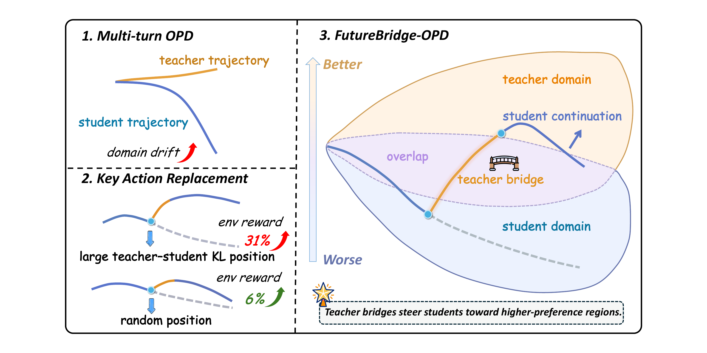
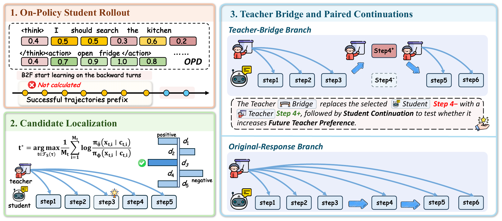

# Look Ahead Before You Distill: Future Trajectory Validation of Teacher Guidance for Agentic On-Policy Distillation

Official code release for **FutureBridge-OPD (FTB)**.

On-policy distillation supervises a Student on its own visited states, but
errors can accumulate in multi-turn trajectories and move later states away
from regions where Teacher guidance is useful. FutureBridge-OPD inserts a
candidate Teacher bridge at a high-disagreement Student turn and compares
frozen-Student continuations from the original and bridged states. The bridge
is retained only when the bridged continuation is more strongly preferred by
the Teacher.

<p align="center">
  
</p>

FTB uses a successful reference prefix to initialize the environment, selects
the non-final Student turn with the largest token-average Teacher–Student
disagreement, and validates one Teacher bridge with paired three-turn
continuations.

<p align="center">
  
</p>

## Hardware and system requirements

- Linux with CUDA and NCCL
- Python 3.10
- 8 NVIDIA A100 GPUs for the full Teacher–Student configurations
- Java 17 or newer for WebShop and ScienceWorld
- Sufficient local storage for model checkpoints
- Approximately 1 TB of host memory for the full WebShop setup

## Installation

### Python environment

```bash
conda create -n futurebridge python=3.10
conda activate futurebridge
python -m pip install --upgrade pip
```

### Python dependencies

This repository bundles the [TCOD](https://github.com/kokolerk/TCOD) training
framework together with the FutureBridge-OPD workflows. Install the runtime
dependencies and the framework:

```bash
python -m pip install -r requirements_freeze.txt
python -m pip install -e . --no-deps
```

The main dependencies include:

- `verl`, `ray`, `transformers`, `datasets`
- `vllm` — **all reported results were obtained with `vllm==0.8.5.post1`**,
  which is pinned in `requirements_freeze.txt`. Evaluation can be sensitive
  to the vLLM version: newer releases change generation-side behavior, and
  the effect is more visible on benchmarks with long, weakly constrained
  interactions (e.g., ScienceWorld) than on highly structured ones
  (e.g., ALFWorld). We therefore recommend using the pinned version when
  reproducing the paper numbers.
- `flash-attn`, `wandb`, `tensorboard`, `omegaconf`
- `sqlalchemy`, `psycopg2-binary`
- `openai`, `jsonlines`

### Benchmark environments

Install [ALFWorld](https://github.com/alfworld/alfworld) and download its data:

```bash
python -m pip install alfworld
alfworld-download --data-dir ./alf-data
```

Install [WebShop](https://github.com/princeton-nlp/webshop) and its search data:

```bash
git clone https://github.com/princeton-nlp/webshop.git
cd webshop
conda install -c conda-forge openjdk=17
./setup.sh -d all
```

Install [ScienceWorld](https://github.com/allenai/ScienceWorld):

```bash
git clone https://github.com/allenai/ScienceWorld.git
cd ScienceWorld
python -m pip install .
```
